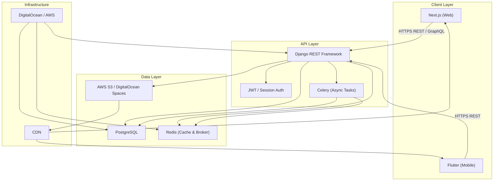
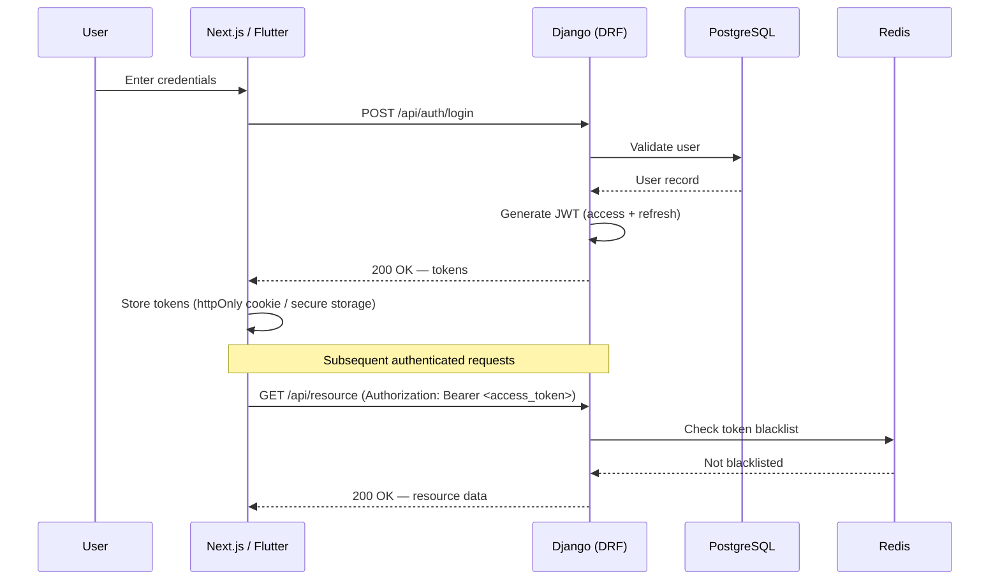
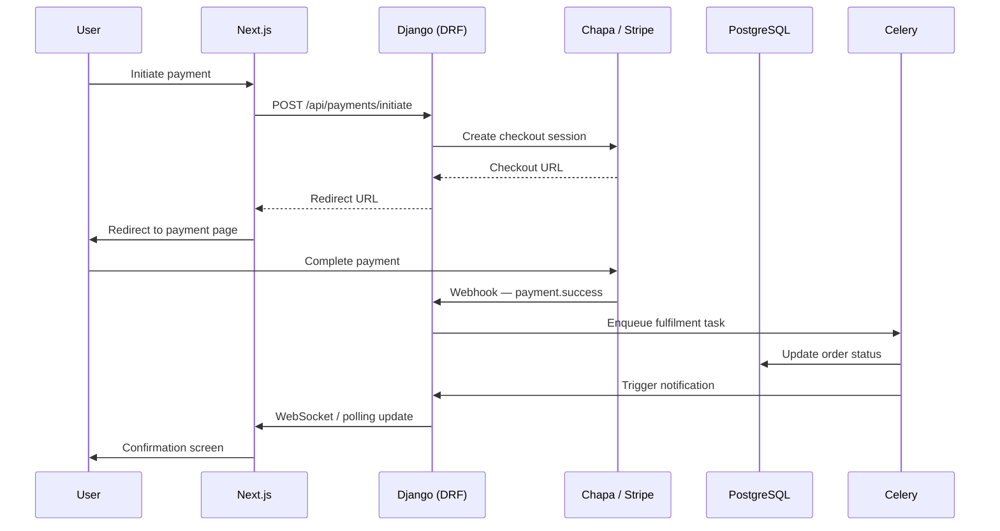

# System Architecture — Data Flow

This document illustrates the data flow between the Django backend and the Next.js / Flutter frontends used across AV SaaS projects.

---

## High-Level Request Flow

---

## Authentication Flow

---

## Payment Flow (Chapa / Stripe)

---

## Component Responsibilities

| Layer | Technology | Role |
|-------|-----------|------|
| Web Frontend | Next.js 14 (App Router) | SSR/SSG, user interface, API consumption |
| Mobile Frontend | Flutter | Cross-platform mobile app |
| API Backend | Django + DRF | Business logic, auth, REST endpoints |
| Task Queue | Celery + Redis | Async jobs: emails, payments, reports |
| Primary Database | PostgreSQL | Relational data storage |
| Cache / Broker | Redis | Session cache, Celery message broker |
| Object Storage | AWS S3 / DO Spaces | Media, documents, exports |
| Infrastructure | AWS / DigitalOcean | Hosting, networking, CDN |
